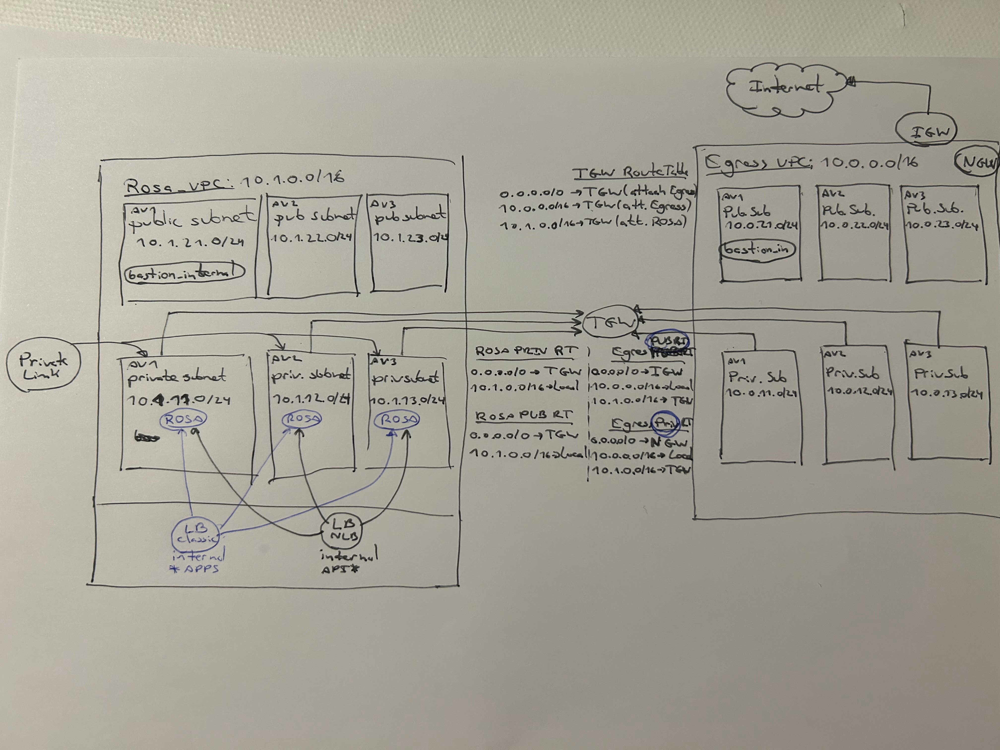

# ROSA w/ private link and STS

The code in this repo will create the necesary AWS resources required to deploy Red Hat OpenShift Service on AWS (ROSA) cluster using private link and Secure Token Service.
It will create the cluster in a 3 AZs.

This Terraform template will deploy a Hub and Spoke architecture, with an egress VPC. For internet access, the trafic will flow towards the egress VPC.
## Resources

### For the ROSA cluster
 * ROSA VPC
 * Private subnets only
 * Egress traffic is routed to the TGW.
 * Routing tables, rules and association for each subnet
 * Bastion Host 1. configured on the public subnet of the ROSA VPC.

### Hub - TGW
 * Attachments to the privete subnetworks

### Egress VPC
 * EGRESS VPC
 * Internet GW
 * EIP
 * NAT GW
 * Bastion Host2

### Two Bastion hosts are deployed


## Diagram




## Prerequisites

 * The terraform AWS provider will need the user to be [authenticated](https://registry.terraform.io/providers/hashicorp/aws/latest/docs#authentication-and-configuration)
 * The terraform CLI

## Deploy Environment
1. Rename the file terraform.tsvars.example to terraform.tsvars, and configure in the file the SSH public Key parameter
```
mv terraform.tsvars.example terraform.tsvars
vi terraform.tsvars
```

2. Clone this repo
```
$ git clone https://github.com/luisevm/terraform-rosa.git
```

3. Go to path
```
cd terraform-rosa/roots/rosa_privatelink_sts_3azs
```

4. Deploy AWS resources
```
terraform init
terraform plan -out "rosa.plan"
terraform apply "rosa.plan"
```

## Deploy Cluster

- Run the script that is displayed in the output of terraform apply command.
- SSH into the bastion host as instructed


